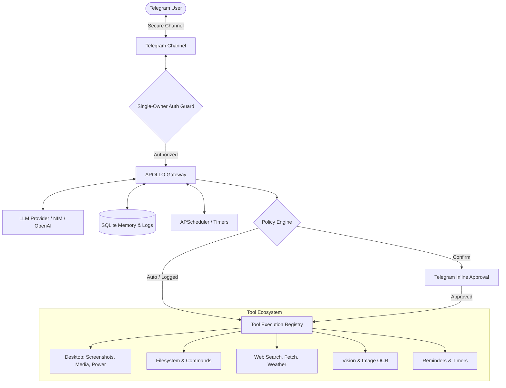

# 🚀 APOLLO

<div align="center">

```text
 █████╗ ██████╗  ██████╗ ██╗     ██╗      ██████╗ 
██╔══██╗██╔══██╗██╔══██╗██║     ██║     ██╔═══██╗
███████║██████╔╝██║  ██║██║     ██║     ██║   ██║
██╔══██║██╔═══╝ ██║  ██║██║     ██║     ██║   ██║
██║  ██║██║     ██████╔╝███████╗███████╗╚██████╔╝
╚═╝  ╚═╝╚═╝     ╚═════╝ ╚══════╝╚══════╝ ╚═════╝ 
```

### **Adaptive Personal Operator for Learning, Life & Optimization**

*An autonomous, single-owner AI workstation assistant and pocket co-pilot powered by Telegram & modern LLMs.*

---

[](https://www.python.org/)
[](LICENSE)
[]()
[]()

</div>

---

## 📖 Overview

**APOLLO** is your personal workstation operator accessible directly from your smartphone via Telegram. Whether you are away from your desk, commuting, or lying in bed, APOLLO grants you full remote control over your Linux workstation, executes complex multi-step reasoning with tool orchestration, preserves long-term memories, and proactively assists you throughout the day.

---

## ✨ Key Features

- **📱 Secure Telegram Interface**: Single-owner authorization guard ensuring only *you* can command your workstation.
- **🧠 Advanced Reasoning & Visible Thought**: Displays full `<think>` reasoning inside native expandable Telegram blockquotes alongside transparent real-time tool execution status.
- **🛡️ Granular 3-Tier Security Policy**: Strict execution tiers (`auto`, `logged`, `confirm`) with interactive `[✅ Approve]` / `[❌ Deny]` inline keyboard buttons for sensitive operations.
- **🖥️ Desktop & Wayland Integration**:
  - Remote screen capture (`grimblast` / `grim`) sent straight to chat.
  - Audio & media playback control (`playerctl` & `wpctl` volume/mute).
  - Session lock, DPMS screen sleep, and power management (`systemctl`, `loginctl`, `hyprctl`).
- **👁️ Multimodal Vision & OCR**: Inspect and analyze screenshots, diagrams, and images directly in chat.
- **💾 Long-Term SQLite Memory & Context Window**: Automatically manages conversation history, sliding context windows, and persistent user memories across sessions.
- **⏰ Natural Language Scheduler & Reminders**: Background cron and precision timer system (APScheduler) for one-shot alarms, proactive check-ins, and recurring routines.
- **🌐 Internet & Research Suite**: Search the web, fetch clean content, download files, and retrieve live weather.
- **🧙 Interactive Setup Wizard**: Easy-to-use CLI wizard (`wizard.py`) for credential configuration, Telegram testing, and `systemd` daemon auto-boot management.

---

## 🏗️ Architecture



---

## 🚀 Quickstart

### 1. Clone & Setup Environment

```bash
git clone https://github.com/Hexarion0/APOLLO.git
cd APOLLO

# Create virtual environment
python3 -m venv .venv
source .venv/bin/activate

# Install dependencies
pip install -r requirements.txt
```

### 2. Run the Interactive Wizard

APOLLO includes an interactive setup wizard to configure API keys, test bot connectivity, and configure `systemd` auto-boot:

```bash
python3 wizard.py
```

### 3. Manual Configuration (Alternative)

Copy the example environment file and edit your credentials:

```bash
cp .env.example .env
```

Key variables in `.env`:
```ini
# LLM Provider (NVIDIA NIM or OpenAI-Compatible Endpoint)
NVIDIA_API_KEY=nvapi-...
NVIDIA_MODEL=nvidia/nemotron-3-ultra-550b-a55b
FALLBACK_MODELS=nvidia/nemotron-3-super-120b-a12b,meta/llama-3.2-11b-vision-instruct

# Telegram Configuration
TELEGRAM_BOT_TOKEN=123456789:ABCdefGhIJKlmNoPQRsTUVwxyZ
TELEGRAM_OWNER_ID=1234567890
```

> 💡 *To find your Telegram user ID, message [@userinfobot](https://t.me/userinfobot) or [@RawDataBot](https://t.me/RawDataBot).*

### 4. Start APOLLO

```bash
python3 main.py
```

---

## 🔒 Security & Policy Tiers (`policy.json`)

Tools are categorized into three authorization tiers configured in `policy.json`:

| Tier | Behavior | Example Tools |
| :--- | :--- | :--- |
| **`auto`** | Executes immediately without prompts. | `get_system_info`, `get_current_time`, `list_directory`, `get_weather`, `recall_memory` |
| **`logged`** | Executes immediately; logs parameters & results to `audit.log`. | `read_file`, `write_file`, `execute_command`, `web_search`, `fetch_url`, `download_file` |
| **`confirm`** | Pauses execution and asks for confirmation via Telegram buttons. | `system_power`, `schedule_task`, `cancel_task` |

---

## 🛠️ Built-in Tool Registry

| Category | Tools | Description |
| :--- | :--- | :--- |
| **Desktop & Wayland** | `take_screenshot`, `media_control`, `system_power` | Take screenshots, adjust volume / track playback, lock screen, sleep PC. |
| **System & Shell** | `get_system_info`, `execute_command` | Inspect CPU, RAM, disk, OS info, and execute system commands. |
| **Files & Code** | `read_file`, `write_file`, `list_directory`, `git_status`, `git_diff` | Read/write local files, explore trees, check git repositories. |
| **Web & Internet** | `web_search`, `fetch_url`, `download_file`, `get_weather` | Search DuckDuckGo, fetch web pages, download assets, retrieve forecasts. |
| **Vision** | `analyze_image` | Multimodal OCR, diagram parsing, UI screenshot analysis. |
| **Memory** | `store_memory`, `recall_memory`, `import_memory` | Long-term facts, preferences, and knowledge storage. |
| **Reminders** | `set_reminder`, `list_reminders`, `cancel_reminder` | Background timers and natural-language notifications. |

---

## 🔄 Systemd Service (Auto-Boot)

To run APOLLO continuously in the background on startup:

```bash
# Using the wizard:
python3 wizard.py
# Select option to install systemd service

# Or manually:
systemctl --user enable --now apollo.service
```

Check service status and logs:
```bash
systemctl --user status apollo.service
journalctl --user -u apollo.service -f
```

---

## 🧪 Testing

Run the comprehensive test suite (150+ unit and integration tests):

```bash
.venv/bin/pytest
```

---

## 📂 Project Structure

```text
APOLLO/
├── apollo/
│   ├── bridge/          # External integrations & IPC bridges
│   ├── channels/        # Channel interfaces (Telegram, CLI, etc.)
│   ├── memory/          # SQLite persistence & sliding context window
│   ├── providers/       # LLM provider abstractions (OpenAI, NVIDIA NIM)
│   ├── scheduler/       # APScheduler reminder & cron engine
│   ├── tools/           # Modular tool registry (Desktop, Web, Shell, Vision)
│   ├── audit.py         # Structured audit logging
│   ├── auth.py          # Single-owner authorization guard
│   ├── config.py        # Pydantic configuration & env loader
│   ├── gateway.py       # Central message dispatcher & reasoning loop
│   ├── persona.py       # Dynamic persona injection
│   └── policy.py        # Security policy & tier engine
├── main.py              # Application entrypoint
├── wizard.py            # CLI setup & service management wizard
├── config.json          # Default configuration parameters
├── policy.json          # Security tiers per tool
├── persona.txt          # System prompt & behavioral guidelines
└── requirements.txt     # Python dependencies
```

---

## 📄 License

This project is licensed under the [MIT License](LICENSE).
