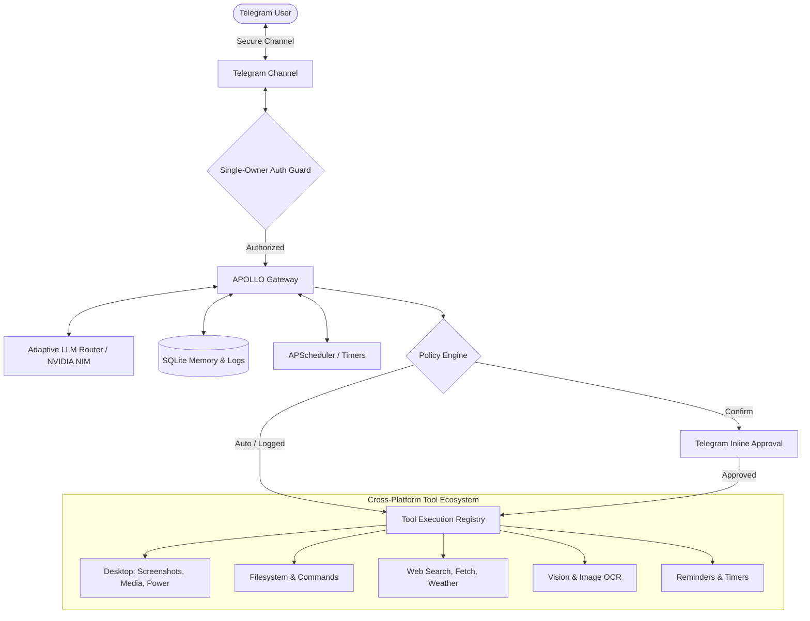

# 🚀 APOLLO

<div align="center">

```text
 █████╗ ██████╗  ██████╗ ██╗     ██╗      ██████╗ 
██╔══██╗██╔══██╗██╔══██╗██║     ██║     ██╔═══██╗
███████║██████╔╝██║  ██║██║     ██║     ██║   ██║
██╔══██║██╔═══╝ ██║  ██║██║     ██║     ██║   ██║
██║  ██║██║     ██████╔╝███████╗███████╗╚██████╔╝
╚═╝  ╚═╝╚═╝     ╚═════╝ ╚══════╝╚══════╝ ╚═════╝ 
```

### **Adaptive Personal Operator for Learning, Life & Optimization**

*An autonomous, single-owner AI workstation assistant and pocket co-pilot powered by Telegram, NVIDIA NIM, and cross-platform desktop automation.*

---

[](https://www.python.org/)
[](LICENSE)
[]()
[]()

</div>

---

## 📖 Overview

**APOLLO** is your personal workstation operator accessible directly from your smartphone via Telegram. Whether you are away from your desk, commuting, or lying in bed, APOLLO grants you full remote control over your workstation, executes multi-step reasoning with tool orchestration, preserves long-term memories, and proactively assists you throughout the day.

Built with a **dual-boot / cross-platform architecture**, APOLLO runs seamlessly on **Arch Linux (Hyprland / Wayland)** and **Windows 10/11** using a unified shared workspace.

---

## ✨ Key Features

- **📱 Secure Telegram Interface**: Single-owner authorization guard ensuring only *you* can command your workstation.
- **⚡ Adaptive Model Routing**: Classifies incoming prompts dynamically across **Fast** (`nemotron-3-super`), **Balanced** (`nemotron-4-340b`), and **Complex** (`nemotron-3-ultra-550b`) models for the best speed/intelligence trade-off.
- **🧠 Advanced Reasoning & Visible Thought**: Displays full `<think>` reasoning inside native expandable Telegram blockquotes alongside transparent real-time tool execution status.
- **🛡️ Granular 3-Tier Security Policy**: Strict execution tiers (`auto`, `logged`, `confirm`) with interactive `[✅ Approve]` / `[❌ Deny]` inline keyboard buttons for sensitive operations.
- **🖥️ Cross-Platform Workstation Control**:
  - **Linux (Wayland/Hyprland)**: Screen captures via `grimblast`/`grim`, audio/media via `playerctl` & `wpctl`, lock via `hyprlock`/`swaylock`, power via `systemctl`.
  - **Windows**: Screen capture via Pillow, display standby, workstation lock, and power controls.
- **👁️ Multimodal Vision & OCR**: Inspect and analyze screenshots, diagrams, and images directly in chat.
- **💾 Long-Term SQLite Memory**: Automatically manages conversation history, sliding context windows, and persistent user memories across sessions.
- **⏰ Natural Language Scheduler & Reminders**: Background cron and precision timer system (APScheduler) for one-shot alarms, proactive check-ins, and recurring routines.
- **🌐 Internet & Research Suite**: Search the web, fetch clean content, download files, and retrieve live weather.
- **💻 Unified Management CLI (`apollo`)**: Manage, start, stop, monitor, configure, and test APOLLO with a single CLI command on both Linux and Windows.

---

## 🏗️ Architecture



---

## 💻 Unified CLI (`apollo`)

APOLLO includes a global CLI for managing the entire system:

```bash
# Check status, database metrics, and service health
apollo status

# Start / Stop / Restart APOLLO
apollo start
apollo stop
apollo restart

# View logs in real-time (live tail)
apollo logs -f

# View or edit configuration
apollo config
apollo config edit

# View or edit system persona prompt
apollo persona
apollo persona edit

# Run unit tests
apollo test

# Manage auto-start on boot
apollo autostart status
apollo autostart enable
apollo autostart disable

# Launch the interactive configuration wizard
apollo wizard
```

> **On Windows**: Run `apollo <command>` or `.\apollo.bat <command>` from Command Prompt or PowerShell.

---

## 🚀 Quickstart

### 1. Setup Virtual Environment

#### On Linux:
```bash
git clone https://github.com/Hexarion0/APOLLO.git
cd APOLLO
python3 -m venv .venv
source .venv/bin/activate
pip install -r requirements.txt
```

#### On Windows:
Double-click `start_windows.bat` or run:
```cmd
python -m venv .venv_win
.\.venv_win\Scripts\activate
pip install -r requirements.txt
```

### 2. Configure Credentials (`.env`)

Copy `.env.example` to `.env` and fill in your keys:
```ini
# LLM Provider (NVIDIA NIM or OpenAI-Compatible Endpoint)
NVIDIA_API_KEY=nvapi-...

# Telegram Bot & Owner
TELEGRAM_BOT_TOKEN=123456789:ABCdefGhIJKlmNoPQRsTUVwxyZ
TELEGRAM_OWNER_ID=1234567890
```

> 💡 *To find your Telegram user ID, message [@userinfobot](https://t.me/userinfobot) or [@RawDataBot](https://t.me/RawDataBot).*

### 3. Start APOLLO

- **Linux**: `apollo start` (or `systemctl --user start apollo.service`)
- **Windows**: `start_windows.bat` (or double-click `install_autostart_windows.bat` for automatic boot start)

---

## 🔒 Security & Policy Tiers (`policy.json`)

Tools are categorized into three authorization tiers configured in `policy.json`:

| Tier | Behavior | Example Tools |
| :--- | :--- | :--- |
| **`auto`** | Executes immediately without prompts. | `get_system_info`, `get_current_time`, `list_directory`, `get_weather`, `recall_memory` |
| **`logged`** | Executes immediately; logs parameters & results to `audit.log`. | `read_file`, `write_file`, `execute_command`, `web_search`, `fetch_url`, `download_file` |
| **`confirm`** | Pauses execution and asks for confirmation via Telegram buttons. | `system_power`, `schedule_task`, `cancel_task` |

---

## 🛠️ Built-in Tool Registry

| Category | Tools | Description |
| :--- | :--- | :--- |
| **Desktop & Session** | `take_screenshot`, `media_control`, `system_power` | Take screenshots, adjust volume / track playback, lock screen, sleep PC. |
| **System & Shell** | `get_system_info`, `execute_command` | Inspect CPU, RAM, disk, OS info, and execute system commands. |
| **Files & Code** | `read_file`, `write_file`, `list_directory`, `git_status`, `git_diff` | Read/write local files, explore trees, check git repositories. |
| **Web & Internet** | `web_search`, `fetch_url`, `download_file`, `get_weather` | Search DuckDuckGo, fetch web pages, download assets, retrieve forecasts. |
| **Vision** | `analyze_image` | Multimodal OCR, diagram parsing, UI screenshot analysis. |
| **Memory** | `store_memory`, `recall_memory`, `import_memory` | Long-term facts, preferences, and knowledge storage. |
| **Reminders** | `set_reminder`, `list_reminders`, `cancel_reminder` | Background timers and natural-language notifications. |

---

## 📂 Project Structure

```text
APOLLO/
├── apollo/                       # Core Python package
│   ├── bridge/                   # User-session Wayland/desktop bridge
│   ├── channels/                 # Telegram bot and messaging channels
│   ├── memory/                   # SQLite memory store and importer
│   ├── providers/                # NVIDIA NIM API client & adaptive router
│   ├── scheduler/                # APScheduler cron and background jobs
│   ├── tools/                    # Built-in, internet, vision & desktop tools
│   ├── cli.py                    # Unified cross-platform CLI implementation
│   └── gateway.py                # Central coordinator & message pipeline
├── data/                         # SQLite database (memories, history)
├── logs/                         # Chat and audit logs
├── systemd/                      # Linux systemd user service units
├── tests/                        # 150+ automated unit & integration tests
├── apollo.sh                     # Linux CLI entrypoint
├── apollo.bat                    # Windows CLI entrypoint
├── config.json                   # Gateway & model configuration
├── persona.txt                   # System prompt & personality definition
├── policy.json                   # Tool security execution policy
├── requirements.txt              # Python dependencies
├── start_windows.bat             # 1-click Windows launcher
├── start_windows_background.vbs  # Silent background runner for Windows
├── install_autostart_windows.bat # Windows startup installer
└── README.md                     # Documentation
```

---

## 🧪 Testing

Run the comprehensive test suite (151 unit and integration tests):

```bash
apollo test
```

---

## 📄 License

This project is licensed under the [MIT License](LICENSE).
